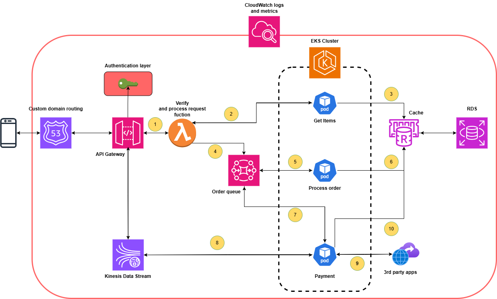

Provide your solution here:

In this project, I use below AWS services:
- Route 53: Routing traffic to API Gateway custom domain
- API Gateway: Handle API request
- Lambda: Verify request and process request
- EKS: fully managed Kubernetes service
- AWS MQ: Manage Order queue
- ElasticCache: Caching result for query
- RDS: Relational database to store user and transaction details
- Kinesis Data Stream: Real time process payment for your order
- CloudWatch: Monitoring and logging your services

**Architect**

Order processes:    
1. Client request to API Gateway to get list of items
2. Lambda verify request and request services in AKS cluster to collect information
3. Service "Get items" in AKS cluster read data from RDS and send back to client
4. From above informations, client place an order, request will be send to Order queue
5. "Process order" read from AWS MQ
6. "Process order" will verify user data and process this order then send back to AWS MQ
7. "Payment" app read order details from queue
8. "Payment" app will send details to client and waiting the client pay for this order
9. "Payment" app verify with 3rd party to get confirm the payment then return result to client
10. "Payment" app write data to RDS for this transaction